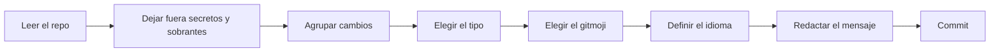

<div align="center">

# gitmoji-commits

**Un skill para agentes que escribe commits como lo haría un desarrollador con experiencia.**

gitmoji + Conventional Commits · cualquier idioma · sin dependencias · Linux, macOS y Windows

[](LICENSE)
[](https://skills.sh)
[](#compatibilidad)
[](#compatibilidad)

[English](README.md) · [Español](README.es.md)

</div>

```
npx skills add CXmiloxx/gitmoji-commits
```

---

## Antes y después

Lo que un agente suele commitear:

```
Update files and fix bug

- Modified src/components/LoginForm.tsx
- Updated package.json
- Fixed bug in auth

🤖 Generated with AI
Co-Authored-By: AI Assistant <noreply@example.com>
```

Lo que commitea con **gitmoji-commits**:

```
🐛 fix(auth): sesiones cerradas al cambiar la contraseña

Cambiar la contraseña dejaba abiertas las sesiones en otros dispositivos,
así que una sesión robada seguía funcionando. Ahora todas las sesiones
activas terminan cuando cambia la contraseña.
```

Una intención por commit. Un título que dice qué cambió. Un cuerpo que explica por qué importa. Sin listas de archivos ni firmas de IA.

## Características

| | |
|---|---|
| 🧭 **Se adapta al repositorio** | Lee el historial reciente para saber el idioma, los scopes y el estilo de emoji que ya usas. Si hay commitlint o una convención escrita, sigue eso. |
| 🌍 **Cualquier idioma** | Los commits salen en español, inglés, francés, portugués, alemán o cualquier otro idioma, según el proyecto. |
| 🔤 **Términos de programación en inglés** | *dashboard*, *endpoint*, *deploy* o *token* no se traducen, salvo que lo pidas. |
| 🌳 **Decide el tipo** | Diez preguntas de sí/no sobre las rutas modificadas y el diff, gana la primera, y distinguen `feat`, `fix`, `refactor`, `perf`, `style`, `docs`, `test`, `build`, `ci`, `chore` y `revert`. |
| 😀 **Los 75 gitmojis** | Cada gitmoji pertenece a un solo tipo, y los pocos que admiten un segundo llevan escrita la condición literal que lo permite. El par se busca en el catálogo y se verifica antes de escribir el mensaje, así que un 🐛 nunca acaba en un `feat`. |
| 📦 **Agrupa los cambios** | Divide lo pendiente en commits de una sola intención, en orden lógico. Los tests y la documentación van con el cambio al que pertenecen. |
| 🔐 **Cuida lo que se sube** | Detecta tokens, claves, contraseñas y cadenas de conexión escritas en el código, y deja fuera los `.env`, las notas de sesión, los logs, los dumps y otros archivos sobrantes. Te dice qué dejó fuera y por qué. |
| 🚫 **Sin firmas de IA** | Ni `Co-Authored-By` de herramientas de IA, ni «Generated with», ni 🤖. |
| ⚡ **Ahorra tokens** | Un solo archivo corto guía todo el flujo. El catálogo completo solo se lee cuando hace falta. |
| 💻 **Portable** | Solo necesita `git`. Sin scripts, sin Node, sin Python. Funciona en bash, zsh, PowerShell y cmd. |

## Instalación

Con la CLI de [skills](https://skills.sh):

```bash
# en el proyecto actual
npx skills add CXmiloxx/gitmoji-commits

# para todos tus proyectos (nivel usuario)
npx skills add CXmiloxx/gitmoji-commits -g

# para todos los agentes instalados en la máquina
npx skills add CXmiloxx/gitmoji-commits -a '*'
```

Instalación manual: copia esta carpeta en el directorio de skills de tu agente, por ejemplo `.claude/skills/gitmoji-commits/` o `.agents/skills/gitmoji-commits/`.

## Uso

Solo pídele a tu agente que haga el commit:

> haz el commit
> commit this
> divide estos cambios en commits
> prepara los commits para el PR
> mejora este mensaje de commit: "arreglos varios"

Para dejar la convención escrita en el repositorio:

> documenta la convención de commits

El agente genera `COMMIT_CONVENTION.md` a partir de lo que encontró en tu historial.

## Cómo funciona



1. **Leer.** Ejecuta `git status`, las estadísticas del diff y los últimos 20 títulos, y busca reglas existentes (commitlint, `COMMIT_CONVENTION.md`, `CONTRIBUTING`).
2. **Filtrar.** Un `git grep` busca secretos escritos en el código de los archivos modificados. Los archivos secretos por naturaleza y los sobrantes (notas de sesión, logs, temporales, comprimidos, configuración local) no se agregan al staging y se reportan.
3. **Agrupar.** Una intención funcional por commit, el menor número de commits posible.
4. **Tipo.** Diez preguntas de sí/no en orden, gana el primer `sí`: revert → docs → test → ci → build → feat/fix → perf → style → refactor → chore.
5. **Gitmoji.** Parte del gitmoji por defecto del tipo, busca al candidato en el catálogo y lo conserva solo si el tipo de esa fila coincide (o si su condición de excepción se cumple literalmente). El par se declara y se contrasta con la tabla antes de escribir el mensaje.
6. **Idioma.** Por orden de prioridad: lo que pidas, luego el archivo de convención, luego el historial, luego el README y por último el idioma en que escribes.
7. **Mensaje.** Un título que describe el cambio sin empezar con verbo y un cuerpo que explica el porqué y el impacto.
8. **Commit.** Hace staging selectivo y commitea a través de un archivo UTF-8, para que los emojis lleguen intactos en cualquier sistema.

## Formato

```
<gitmoji> tipo(scope): título

<cuerpo>
```

| Parte | Regla |
|---|---|
| **gitmoji** | Válido para el tipo. Se usa el carácter del emoji, salvo que el repo use `:shortcodes:`. |
| **tipo** | Uno de los 11 tipos de abajo, siempre en inglés y en minúsculas. |
| **scope** | Un dominio en minúsculas: `auth`, `checkout`, `pedidos`. Nunca un archivo, una clase ni un componente. |
| **título** | Qué cambió, sin empezar con verbo, sin punto final y sin repetir el scope. Unos 72 caracteres para toda la cabecera. |
| **cuerpo** | Qué cambió, por qué y qué impacto tiene, en prosa. En cambios grandes se admite una lista corta de comportamientos. |

### Tipos

| Tipo | Por defecto | Semver | Cuándo |
|---|---|---|---|
| `feat` | ✨ | minor | Alguien puede hacer algo que antes no podía |
| `fix` | 🐛 | patch | Algo que debía funcionar y no funcionaba, o cualquier otro cambio en cómo se comporta algo que ya existe |
| `refactor` | ♻️ | — | Código reorganizado, mismo comportamiento |
| `perf` | ⚡️ | patch | Mismo comportamiento, más rápido o más ligero de forma medible |
| `style` | 🎨 | — | Solo formato (nunca CSS/UI) |
| `docs` | 📝 | — | Documentación y comentarios de código |
| `test` | ✅ | — | Tests, mocks, fixtures, snapshots |
| `build` | 📦️ | — | Sistema de build, empaquetado, dependencias |
| `ci` | 👷 | — | Pipelines de CI/CD |
| `chore` | 🔧 | — | Mantenimiento que no encaja en otro tipo |
| `revert` | ⏪️ | patch | Deshace un commit anterior |

`feat` siempre lleva ✨. En el catálogo oficial solo ✨ es `minor` y solo 💥 es `major`, así que un gitmoji `patch` como 🚸 o 💄 en un `feat` anuncia un salto de versión que ese gitmoji no tiene. Los gitmojis de área describen un cambio sobre algo que ya existe, y eso cae en `fix`, `perf`, `refactor` o `chore`.

Un cambio incompatible mantiene su tipo y añade 💥 y `!`:

```
💥 feat(api)!: respuestas paginadas en todos los listados

BREAKING CHANGE: los clientes deben leer los resultados del campo `items`.
```

El catálogo completo — cada gitmoji con su tipo único y, cuando existe, la condición de su único tipo alterno — está en [references/gitmojis.md](references/gitmojis.md).

## Ejemplos

| ❌ Evitar | ✅ Escribir | Por qué |
|---|---|---|
| `✨ feat(auth): agregar login con Google` | `✨ feat(auth): inicio de sesión con cuentas de Google` | no empieza con verbo |
| `🐛 fix(LoginForm.tsx): Arreglado bug.` | `🐛 fix(auth): sesiones cerradas al cambiar la contraseña` | scope de dominio, dice qué bug |
| `♻️ refactor: mejoras` | `♻️ refactor(pedidos): totales calculados en un solo lugar` | concreto, no abstracto |
| `⚡️ perf(pedidos): caché Redis en OrderService` | `⚡️ perf(pedidos): historial más rápido en cuentas grandes` | el efecto, no la implementación |
| `✨ feat(dashboard): nuevas gráficas del dashboard` | `✨ feat(dashboard): ventas mensuales por categoría` | no repite el scope |
| `✨ feat(ventas): resumen en el tablero de control` | `✨ feat(ventas): resumen del mes en el dashboard` | los términos de programación van en inglés |

Las mismas reglas en otros idiomas:

```
✨ feat(billing): invoice export per customer
♻️ refactor(panier): calcul des remises dans un seul service
⚡️ perf(relatorios): exportação sem bloquear a interface
✨ feat(suche): Filter nach Preis und Marke
```

## Compatibilidad

| | |
|---|---|
| **Requisitos** | Solo `git` |
| **Sistemas operativos** | Linux, macOS, Windows |
| **Shells** | bash, zsh, fish, PowerShell, cmd |
| **Agentes** | Claude Code, Cursor, Codex y cualquier otro agente que cargue skills `SKILL.md` |

El mensaje del commit se pasa a través de un archivo UTF-8 (`git commit -F`), así que los emojis llegan intactos incluso en consolas de Windows que manejan mal los argumentos Unicode.

## Preguntas frecuentes

**¿Hace push?**
No. Solo hace commits. Nunca hace push, nunca usa `--no-verify` y nunca modifica con `--amend` un commit que ya se subió.

**¿Qué se niega a commitear?**
Secretos escritos en el código (API keys, tokens, contraseñas, llaves privadas, cadenas de conexión con credenciales) y archivos `.env` o de llaves. También deja fuera los sobrantes: notas o planes en Markdown de una sesión de trabajo que nada enlaza, logs, temporales, dumps, comprimidos, salidas de build y configuración personal. Los reporta con los valores secretos ocultos, sugiere qué añadir a `.gitignore` y nunca borra nada. Solo incluye alguno si lo confirmas expresamente.

**Mi repositorio usa commitlint o una convención propia.**
El skill lee esas reglas primero y las sigue. Tienen prioridad sobre todo lo demás.

**Mi historial usa `:sparkles:` en vez de ✨, o 📚 para docs.**
Mantiene el estilo que ya usa tu historial, así el log sigue siendo coherente.

**¿Por qué títulos sin verbo («inicio de sesión con Google» en vez de «agregar login con Google»)?**
El título dice qué contiene el commit, no una tarea por hacer. El resultado se lee como un changelog limpio, en cualquier idioma.

**¿Puedo forzar un idioma?**
Sí: «haz el commit en inglés», «commit in Spanish». Lo que pidas siempre tiene prioridad.

**¿Y si el repositorio todavía no tiene commits?**
Usa el idioma del README o el idioma en que escribes, y empieza el historial con `🎉 chore(project): …`.

**¿Por qué sin firma de IA?**
El historial pertenece al proyecto y a quienes lo desarrollan. Las firmas de atribución añaden ruido a cada log, blame y changelog.

## Estructura

```
gitmoji-commits/
├── SKILL.md                       # el flujo que sigue el agente
├── references/
│   ├── gitmojis.md                # los 75 gitmojis, un tipo cada uno (se lee solo si hace falta)
│   └── convention-template.md     # solo se usa al documentar la convención
├── README.md
├── README.es.md
└── LICENSE
```

## Contribuir

Los issues y los pull requests son bienvenidos, por ejemplo con un ejemplo mejor, un caso especial que falte o un idioma que las reglas no cubran bien. Los commits de este repositorio siguen el propio skill.

## Autor

Camilo Guapacha · [@CXmiloxx](https://github.com/CXmiloxx)

Si este skill te ahorra tiempo, dale una ⭐ al repositorio para que más gente lo encuentre.

## Licencia

[MIT](LICENSE)
