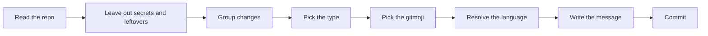

<div align="center">

# gitmoji-commits

**An agent skill that writes git commits the way an experienced developer would.**

gitmoji + Conventional Commits · any language · zero dependencies · Linux, macOS and Windows

[](LICENSE)
[](https://skills.sh)
[](#compatibility)
[](#compatibility)

[English](README.md) · [Español](README.es.md)

</div>

```
npx skills add CXmiloxx/gitmoji-commits
```

---

## Before and after

What an agent usually commits:

```
Update files and fix bug

- Modified src/components/LoginForm.tsx
- Updated package.json
- Fixed bug in auth

🤖 Generated with AI
Co-Authored-By: AI Assistant <noreply@example.com>
```

What it commits with **gitmoji-commits**:

```
🐛 fix(auth): sessions closed after a password change

Changing the password left other devices signed in, so a stolen session
kept working. Every active session now ends when the password changes.
```

One intent per commit. A title that says what changed. A body that explains why it matters. No file lists and no AI signature.

## Features

| | |
|---|---|
| 🧭 **Adapts to your repository** | It reads recent history to learn the language, the scopes and the emoji style you already use. If commitlint or a written convention exists, it follows that. |
| 🌍 **Any language** | Commits come out in Spanish, English, French, Portuguese, German or any other language, matching the project. |
| 🔤 **Programming terms stay in English** | *dashboard*, *endpoint*, *deploy* and *token* are never translated, unless you ask. |
| 🌳 **Decides the type** | Ten yes/no questions about the changed paths and the diff, first match wins, separate `feat`, `fix`, `refactor`, `perf`, `style`, `docs`, `test`, `build`, `ci`, `chore` and `revert`. |
| 😀 **All 75 gitmojis** | Every gitmoji belongs to exactly one type, and the few that allow a second one carry the literal condition that permits it. The pair is looked up in the catalog and verified before the message is written, so a 🐛 never lands on a `feat`. |
| 📦 **Groups changes** | It splits your working tree into single-intent commits, in logical order. Tests and docs travel with the change they belong to. |
| 🔐 **Guards what gets committed** | It finds hardcoded tokens, keys, passwords and connection strings, and leaves out `.env` files, session notes, logs, dumps and other leftovers. It tells you what it skipped and why. |
| 🚫 **No AI signatures** | No `Co-Authored-By` for AI tools, no "Generated with", no 🤖. |
| ⚡ **Light on tokens** | One short file drives the whole flow. The full catalog is read only when needed. |
| 💻 **Portable** | Only `git`. No scripts, no Node, no Python. It works in bash, zsh, PowerShell and cmd. |

## Install

Using the [skills](https://skills.sh) CLI:

```bash
# in the current project
npx skills add CXmiloxx/gitmoji-commits

# for every project (user level)
npx skills add CXmiloxx/gitmoji-commits -g

# for every agent installed on the machine
npx skills add CXmiloxx/gitmoji-commits -a '*'
```

Manual install: copy this folder into your agent's skills directory, for example `.claude/skills/gitmoji-commits/` or `.agents/skills/gitmoji-commits/`.

## Usage

Just ask your agent to commit:

> commit this
> haz el commit
> split these changes into commits
> prepara los commits para el PR
> improve this commit message: "fixed stuff"

To write the convention down in the repository:

> document the commit convention

The agent generates `COMMIT_CONVENTION.md` from what it found in your history.

## How it works



1. **Read.** It runs `git status`, the diff stats, the last 20 commit subjects, and looks for existing rules (commitlint, `COMMIT_CONVENTION.md`, `CONTRIBUTING`).
2. **Filter.** One `git grep` looks for hardcoded secrets in the changed files. Files that are secret by nature and leftovers (session notes, logs, temporary files, archives, local settings) stay unstaged and are reported.
3. **Group.** One functional intent per commit, as few commits as possible.
4. **Type.** Ten yes/no questions in order, the first `yes` wins: revert → docs → test → ci → build → feat/fix → perf → style → refactor → chore.
5. **Gitmoji.** It starts from the type's default, looks the candidate up in the catalog, and keeps it only if the row's type matches (or its exception condition is literally true). The pair is stated and checked against the table before the message is written.
6. **Language.** In order of priority: what you ask for, then the convention file, then the history, then the README, then the language you write in.
7. **Message.** A noun-phrase title and a body that explains why and what the impact is.
8. **Commit.** It stages selectively and commits through a UTF-8 file, so emojis survive on every OS.

## Format

```
<gitmoji> type(scope): title

<body>
```

| Part | Rule |
|---|---|
| **gitmoji** | Valid for the type. The emoji character is used unless the repository uses `:shortcodes:`. |
| **type** | One of the 11 types below, always in English and lowercase. |
| **scope** | One domain in lowercase: `auth`, `checkout`, `orders`. Never a file, class or component. |
| **title** | What changed, as a noun phrase. No leading verb, no trailing period, and the scope is not repeated. About 72 characters for the whole header. |
| **body** | What changed, why, and what the impact is, in prose. A short list of behaviors is allowed for large changes. |

### Types

| Type | Default | Semver | When |
|---|---|---|---|
| `feat` | ✨ | minor | Someone can now do something they could not do before |
| `fix` | 🐛 | patch | Something that was supposed to work and didn't, or any other change to how something existing behaves |
| `refactor` | ♻️ | — | Code restructured, behavior identical |
| `perf` | ⚡️ | patch | Same behavior, measurably faster or lighter |
| `style` | 🎨 | — | Formatting only (never CSS/UI) |
| `docs` | 📝 | — | Documentation and code comments |
| `test` | ✅ | — | Tests, mocks, fixtures, snapshots |
| `build` | 📦️ | — | Build system, packaging, dependencies |
| `ci` | 👷 | — | CI/CD pipelines |
| `chore` | 🔧 | — | Maintenance that fits nowhere else |
| `revert` | ⏪️ | patch | Undoes an earlier commit |

`feat` always carries ✨. In the official catalog only ✨ is `minor` and only 💥 is `major`, so a `patch` gitmoji such as 🚸 or 💄 on a `feat` announces a version bump it does not carry. Area-specific gitmojis describe a change to something that already exists, which lands on `fix`, `perf`, `refactor` or `chore`.

A breaking change keeps its type and adds 💥 and `!`:

```
💥 feat(api)!: paginated responses in every listing

BREAKING CHANGE: clients must read results from the `items` field.
```

The full catalog — every gitmoji with its single type and, where one exists, the condition for its only alternate type — is in [references/gitmojis.md](references/gitmojis.md).

## Examples

| ❌ Avoid | ✅ Write | Why |
|---|---|---|
| `✨ feat(auth): add Google login` | `✨ feat(auth): sign-in with Google accounts` | no leading verb |
| `🐛 fix(LoginForm.tsx): Fixed bug.` | `🐛 fix(auth): sessions closed after a password change` | domain scope, says which bug |
| `♻️ refactor: improvements` | `♻️ refactor(orders): totals calculated in one place` | concrete, not abstract |
| `⚡️ perf(orders): Redis cache in OrderService` | `⚡️ perf(orders): faster history for large accounts` | the effect, not the implementation |
| `✨ feat(dashboard): new dashboard charts` | `✨ feat(dashboard): monthly sales by category` | the scope is not repeated |
| `✨ feat(ventas): resumen en el tablero de control` | `✨ feat(ventas): resumen del mes en el dashboard` | programming terms stay in English |

The same rules in other languages:

```
🐛 fix(carrito): total correcto con cupones combinados
♻️ refactor(panier): calcul des remises dans un seul service
⚡️ perf(relatorios): exportação sem bloquear a interface
✨ feat(suche): Filter nach Preis und Marke
```

## Compatibility

| | |
|---|---|
| **Requirements** | `git` only |
| **Operating systems** | Linux, macOS, Windows |
| **Shells** | bash, zsh, fish, PowerShell, cmd |
| **Agents** | Claude Code, Cursor, Codex and any other agent that loads `SKILL.md` skills |

Commit messages are passed through a UTF-8 file (`git commit -F`), so emojis stay intact even in Windows consoles that don't handle Unicode arguments well.

## FAQ

**Does it push?**
No. It only commits. It never pushes, never runs `--no-verify`, and never amends a commit that has already been pushed.

**What will it refuse to commit?**
Hardcoded secrets (API keys, tokens, passwords, private keys, connection strings with credentials) and `.env` or key files. It also skips leftovers: Markdown notes or plans from a work session that nothing links to, logs, temporary files, dumps, archives, build output and personal settings. It reports them with any secret value masked, suggests `.gitignore` entries, and never deletes anything. It only includes one of them if you explicitly confirm.

**My repository uses commitlint or its own convention.**
The skill reads those rules first and follows them. They take precedence over everything else.

**My history uses `:sparkles:` instead of ✨, or 📚 for docs.**
It keeps the style your history already uses, so the log stays consistent.

**Why titles without a verb ("sign-in with Google accounts" instead of "add Google login")?**
The title says what the commit contains, not a task to do. The result reads like a clean changelog, in any language.

**Can I force a language?**
Yes: "commit in English", "haz el commit en español". What you ask for always wins.

**What if the repository has no commits yet?**
It uses the README's language, or the language you write in, and starts the history with `🎉 chore(project): …`.

**Why no AI signature?**
The history belongs to the project and its developers. Attribution trailers add noise to every log, blame and changelog.

## Structure

```
gitmoji-commits/
├── SKILL.md                       # the workflow the agent follows
├── references/
│   ├── gitmojis.md                # the 75 gitmojis, one type each (read on demand)
│   └── convention-template.md     # used only when documenting the convention
├── README.md
├── README.es.md
└── LICENSE
```

## Contributing

Issues and pull requests are welcome, for example a better example, a missing edge case or a language the rules don't cover well. Commits in this repository follow the skill itself.

## Author

Camilo Guapacha · [@CXmiloxx](https://github.com/CXmiloxx)

If this skill saves you time, give the repository a ⭐ so more people can find it.

## License

[MIT](LICENSE)
